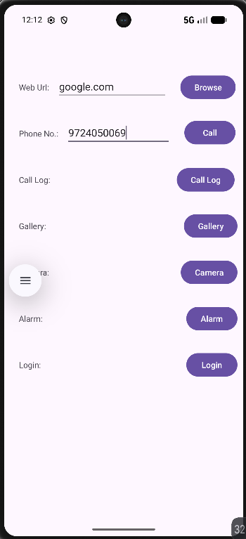
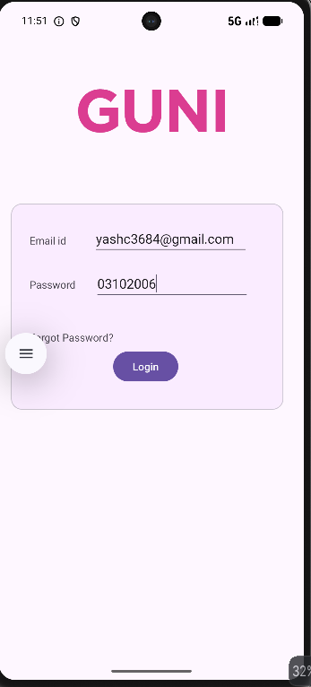

# Practical 3 – Implicit & Explicit Intent

**Subject:** Mobile Application Development (MAD)  
**Practical:** 3  
**Student:** YASH CHAUDHARY  
**Enrollment No.:** 24012011013  
**Department:** Computer Engineering

## AIM

Create an Android application that demonstrates **Implicit Intent** and **Explicit Intent**.

### Operations demonstrated

1. Make a call to a specific number
2. Open a specific URL
3. Open Call Log
4. Open Gallery
5. Set/Open Alarm
6. Open Camera
7. Open Login Activity

---

## Study / Concepts

This practical covers the following Android concepts:

- Intent
- Types of Intent
  - Implicit Intent
  - Explicit Intent
- Intent Actions
- `Intent.setData()`
- `Intent.setType()`
- `Button`
- `ConstraintLayout`
- `CoordinatorLayout`
- `startActivity()`
- `ActivityResultContracts`
- Permissions in `AndroidManifest.xml`
- `ContextCompat.checkSelfPermission()`
- `ActivityCompat.requestPermissions()`
- `Uri.parse()`
- `ContactsContract.Contacts.CONTENT_TYPE`
- `CallLog.Calls.CONTENT_TYPE`
- `"image/*"`
- `"tel:"`

---

## Application Overview

The application contains a main screen with buttons for different Android operations.

| Button | Function | Intent Type |
|---|---|---|
| Browse | Opens the entered web URL | Implicit |
| Call | Opens the dialer with the entered phone number | Implicit |
| Call Log | Opens the device call log | Implicit |
| Gallery | Opens image selection from Gallery | Implicit |
| Camera | Opens the Camera application | Implicit |
| Alarm | Opens the Alarm screen | Implicit |
| Login | Opens `LoginActivity` | Explicit |

---

## 1. Open Specific URL

The user enters a URL and presses **Browse**.

```kotlin
findViewById<Button>(R.id.browse).setOnClickListener {
    Intent(
        Intent.ACTION_VIEW,
        Uri.parse(findViewById<EditText>(R.id.url_text).text.toString())
    ).also {
        startActivity(it)
    }
}
```

### Explanation

- `ACTION_VIEW` asks Android to view the supplied data.
- `Uri.parse()` converts the entered URL into a `Uri`.
- `startActivity()` launches an application capable of handling the URL.

---

## 2. Make Call to Specific Number

The user enters a phone number and presses **Call**.

```kotlin
val callButton = findViewById<Button>(R.id.call)

callButton.setOnClickListener {
    val number = findViewById<EditText>(R.id.phone_number)
        .text.toString()

    val intent = Intent(Intent.ACTION_DIAL)
    intent.setData("tel:$number".toUri())

    startActivity(intent)
}
```

### Explanation

- `ACTION_DIAL` opens the phone dialer.
- `"tel:"` identifies the data as a telephone number.
- `setData()` attaches the phone number to the Intent.
- The example opens the dialer rather than directly placing the call.

---

## 3. Open Call Log

```kotlin
findViewById<Button>(R.id.call_log).setOnClickListener {
    val intent = Intent(
        Intent.ACTION_VIEW,
        Uri.parse("content://call_log/calls")
    )
    startActivity(intent)
}
```

### Explanation

`ACTION_VIEW` is used with the Call Log URI so Android can open an application that handles the call-log content.

---

## 4. Open Gallery

```kotlin
findViewById<Button>(R.id.Gallery).setOnClickListener {
    val intent = Intent(Intent.ACTION_PICK)
    intent.type = "image/*"
    startActivity(intent)
}
```

### Explanation

- `ACTION_PICK` allows the user to select an item.
- `setType()` / `intent.type` specifies that only images should be selected.
- `"image/*"` represents image files of any supported image format.

---

## 5. Open Camera

```kotlin
findViewById<Button>(R.id.Camera).setOnClickListener {
    Intent(MediaStore.ACTION_IMAGE_CAPTURE).also {
        startActivity(it)
    }
}
```

### Explanation

`MediaStore.ACTION_IMAGE_CAPTURE` launches an application capable of taking a picture.

---

## 6. Open Alarm

```kotlin
findViewById<Button>(R.id.Alarm).setOnClickListener {
    Intent(AlarmClock.ACTION_SHOW_ALARMS).also {
        startActivity(it)
    }
}
```

### Explanation

`AlarmClock.ACTION_SHOW_ALARMS` opens the device's Alarm interface.

---

## 7. Open Login Activity – Explicit Intent

The **Login** button opens `LoginActivity`.

```kotlin
findViewById<Button>(R.id.Login).setOnClickListener {
    Intent(this, LoginActivity::class.java).also {
        startActivity(it)
    }
}
```

### Explanation

This is an **Explicit Intent** because the source activity directly specifies the destination activity:

```text
MainActivity → LoginActivity
```

---

## Implicit vs Explicit Intent

### Implicit Intent

An implicit intent does not specify the exact component that should handle the request. Android finds a suitable application/activity based on the action and data.

Examples used in this practical:

- Open URL
- Open Dialer
- Open Call Log
- Open Gallery
- Open Camera
- Open Alarm

### Explicit Intent

An explicit intent specifies the exact component to be launched.

Example:

```kotlin
Intent(this, LoginActivity::class.java)
```

This directly opens `LoginActivity`.

---

## Important Intent Components

### `Intent.ACTION_VIEW`

Used to display or view data.

Example:

```kotlin
Intent(Intent.ACTION_VIEW, Uri.parse(url))
```

### `Intent.ACTION_DIAL`

Used to open the phone dialer with a number.

```kotlin
Intent(Intent.ACTION_DIAL)
```

### `Intent.ACTION_PICK`

Used to allow the user to select an item.

```kotlin
Intent(Intent.ACTION_PICK)
```

### `Intent.setData()`

Sets the data URI for an Intent.

```kotlin
intent.setData("tel:$number".toUri())
```

### `Intent.setType()`

Specifies the MIME type of data.

```kotlin
intent.type = "image/*"
```

### `Uri.parse()`

Converts a string into a `Uri`.

```kotlin
Uri.parse("https://google.com")
```

### `startActivity()`

Starts another activity or an external activity capable of handling the Intent.

```kotlin
startActivity(intent)
```

---

## MainActivity Structure

```text
MainActivity
│
├── Browse → Open URL
├── Call → Open Dialer
├── Call Log → Open Call Log
├── Gallery → Open Gallery
├── Camera → Open Camera
├── Alarm → Open Alarm
└── Login → LoginActivity
```

---

## Output

### Main Activity

The main screen demonstrates the Browse, Call, Call Log, Gallery, Camera, Alarm, and Login options.



### Login Activity

The Login button demonstrates the Explicit Intent by opening `LoginActivity`.



---

## Project Files

```text
app/
└── src/
    └── main/
        ├── java/
        │   └── com.example.mad_practical_3_24012011013/
        │       ├── MainActivity.kt
        │       └── LoginActivity.kt
        │
        ├── res/
        │   ├── layout/
        │   │   ├── activity_main.xml
        │   │   └── activity_login.xml
        │   └── drawable/
        │       └── guni_pink_logo
        │
        └── AndroidManifest.xml
```

---

## Result

The Android application successfully demonstrates **Implicit Intent** for opening external Android services such as the browser, dialer, call log, gallery, camera, and alarm, and **Explicit Intent** for opening the `LoginActivity`.

---

## Reference

- Add Drawable Resource in Android Project:  
  https://sites.google.com/ganpatuniversity.ac.in/mad/practical-list/practical-3

- Add Activity in Android Project:  
  https://sites.google.com/ganpatuniversity.ac.in/mad/views-android/new-activity
